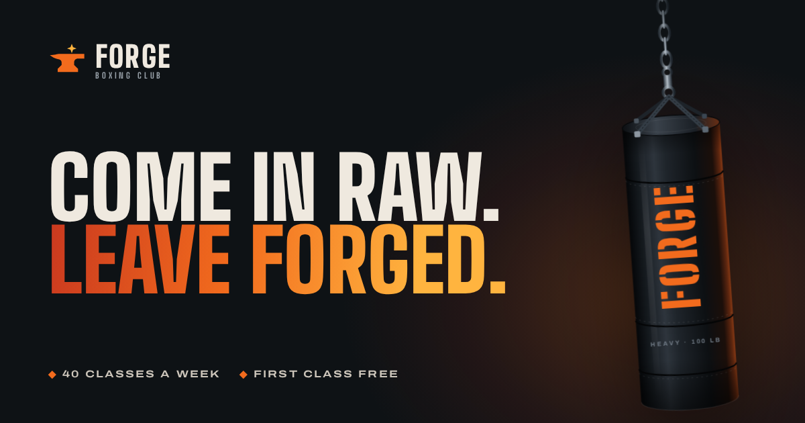

# Forge Boxing Club — website

A fast, hand-built marketing site for **Forge**, a boxing gym. Seven pages plus a 404, no framework, no build step and no dependencies. Upload the folder to any static host and it works.



## What's in it

| Page | What it does |
| --- | --- |
| `index.html` | Home: photo hero with the interactive heavy bag, Who we are, How it works with a membership button, Boxing / Fitness / Parking / Showers icons, live session board, coach feature. |
| `schedule.html` | Timetable: day cards and a to-scale week chart, with live "on now" highlighting. |
| `coach.html` | Meet the Coach: Asanka Rajapakshe's qualifications, career highlights and a photo gallery. |
| `membership.html` | Plans (8 / 12 / 12+ days a month), kids classes, private sessions, the contact form and FAQ. Buttons elsewhere link to `membership.html#kids` and `#contact`. |

| `gallery.html` | Photo and video gallery: 14 photo slots and 4 video slots with filters and a full-screen viewer. |

`404.html` is the error page.

Every page opens with a cosmic, blood-red "Let the pain forge you" preloader (about 4 seconds, once per visit).

## Home page video

The strip under the menu plays `assets/video/hero.webm` (or `hero.mp4` as a fallback) muted and on a loop, with `hero-poster.jpg` shown while it loads. To swap the video, replace those three files and keep the names.

## Add your photos

**Gallery page:** put files in `assets/gallery/` named `photo-1.jpg` … `photo-14.jpg` and `video-1.mp4` … `video-4.mp4`. Each one fills its slot automatically; empty slots show a placeholder.

Drop these files into `assets/img/` and they appear automatically. Until then, the site shows designed placeholders.

| File | Where it shows |
| --- | --- |
| `home.jpg` | Behind the home page hero (landscape, around 2000 × 1300 px) |
| `coach-asanka.jpg` | Coach portrait on the home and coach pages (portrait 4:5, around 800 × 1000 px) |
| `gallery-1.jpg` … `gallery-6.jpg` | "Coach at work" gallery. `gallery-1` is the large tile |

## Preview it

Open `index.html` in a browser, or run a local server from this folder:

```bash
python3 -m http.server 8000
# then visit http://localhost:8000
```

## Put it online

It's a plain static site, so any host works. Nothing needs building.

- **GitHub Pages:** repository **Settings → Pages → Build and deployment → Deploy from a branch**, pick the branch and the `/ (root)` folder, then save. The `.nojekyll` file is already in place.
- **Netlify / Cloudflare Pages / Vercel:** create a new site from this repository, leave the build command empty and set the publish directory to the repository root. On Netlify you can also drag the folder onto the dashboard.

`404.html` is picked up automatically by GitHub Pages, Netlify and Cloudflare Pages.

## Before launch: replace the placeholders

The content is written to be realistic, but the business details are placeholders. Search and replace these across the project:

| Placeholder | Where it appears |
| --- | --- |
| `www.forgeboxing.example` (domain) | `<head>` of every page, the JSON-LD block in `index.html`, `sitemap.xml`, `robots.txt` |
| `hello@forgeboxing.example` | `assets/js/data.js`, footer, contact page, JSON-LD |
| `+94 77 000 0000` / `+94770000000` | `assets/js/data.js`, footer, mobile menu, contact page, membership FAQ, timetable page, JSON-LD |
| Address | Not on the site yet. Add it to the footer and the contact section of `membership.html`, and to `address` in the JSON-LD in `index.html` |
| Social links | Footer (currently point at the Instagram, YouTube and Facebook home pages) |

Everything else (copy, class structure, FAQ answers) is ready to use, but read it through and adjust anything that doesn't match how you run the gym.

## Connect the booking form

Open `assets/js/data.js` and paste a form endpoint into `formEndpoint`:

```js
FORGE.config = {
  formEndpoint: "https://formspree.io/f/your-id",
  email: "hello@yourgym.com",
  ...
};
```

Any service that accepts a JSON `POST` works (Formspree, Basin, Getform, your own API). Bookings arrive with name, email, phone, experience, program interest, chosen class, notes and newsletter opt-in. A hidden `_gotcha` field catches most spam bots.

**If you leave it empty**, the form still works: after validation it opens the visitor's email app with the booking filled in and addressed to `email`, and the confirmation screen tells them to press send.

## Everyday edits

**Timetable.** Edit `FORGE.hours` in `assets/js/data.js`. Each day lists its sessions as `["start", "end"]` in 24-hour time. The timetable page, the home page board, the live "training now" status and the session counts all update from it. Also update the static hours list in the footer, home and contact pages (search for `Mon · Wed · Fri`).

**Prices.** Edit the plan cards in `membership.html` and the options in the contact form on `membership.html`.

**Contact form.** Paste a form endpoint (e.g. Formspree) into `formEndpoint` in `assets/js/data.js`. Left empty, the form opens the visitor's email app with the message filled in.

**Preloader.** It plays once per visit for about 4 seconds. Change the `4200` in `assets/js/main.js` to adjust the length.

## Technical notes

- **No dependencies.** Plain HTML, one stylesheet and small vanilla JavaScript files. The home page transfers about 250 KB with gzip, and about 210 KB of that is the three font files, which are cached after the first visit.
- **Fonts** are self-hosted in `assets/fonts` (Big Shoulders and Archivo, both SIL Open Font License; licence files included), so there are no third-party requests.
- **Accessibility:** skip link, visible focus states, semantic landmarks and headings, labelled controls, keyboard-operable timetable tabs, menu and heavy bag, form errors announced and linked to their fields, and `prefers-reduced-motion` respected (embers, sway and sparks switch off).
- **Performance:** animations pause when off-screen or when the tab is hidden, canvas pixel density is capped, fonts are preloaded.
- **SEO:** unique titles and descriptions, canonical and Open Graph tags, a 1200 × 630 social image, `ExerciseGym` structured data with opening hours, `sitemap.xml` and `robots.txt`.
- **Browser support:** current Chrome, Edge, Safari and Firefox, desktop and mobile. Page-to-page fades use the View Transitions API where supported and fall back to normal navigation elsewhere.

### File map

```
index.html  schedule.html  coach.html  membership.html  404.html
assets/
  css/styles.css        design tokens and all components
  js/data.js            timetable, hours, programs, coaches, form settings
  js/main.js            header, menu, reveals, live session status, preloader timing
  js/preloader.js       cosmic starfield and blood drips
  js/schedule.js        timetable cards, week chart, home session board
  js/forms.js           contact form
  js/embers.js          hero ember particles
  js/bag.js             interactive heavy bag
  fonts/                self-hosted variable fonts + licences
  img/                  logo, favicons, app icons, social image
site.webmanifest  sitemap.xml  robots.txt  .nojekyll
```

### Recommended next steps

- Add a privacy policy page, since the booking form collects personal details.
- Add real photography of the floor, coaches and classes.
- Add member testimonials once you have permission to quote people.
